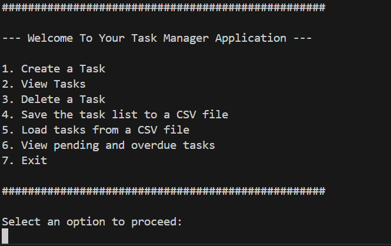
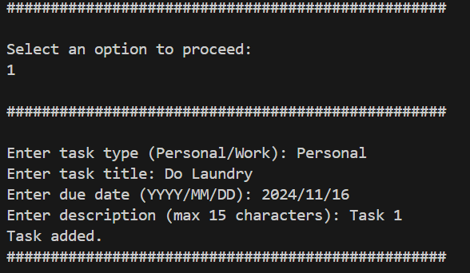
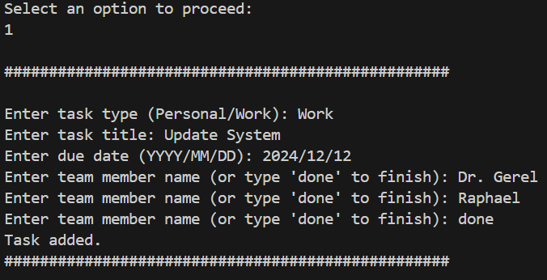
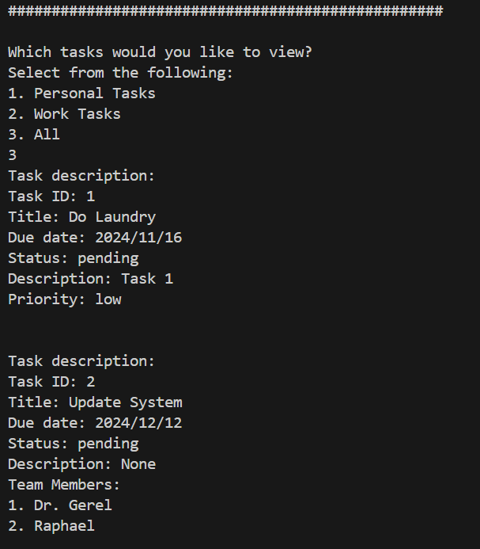
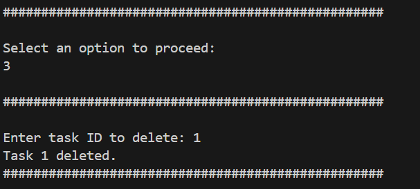
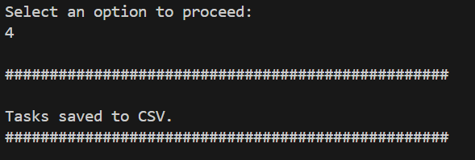
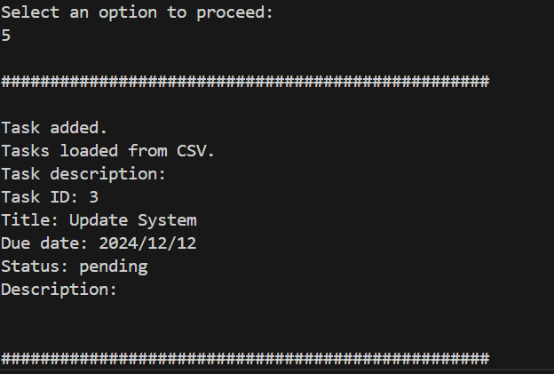
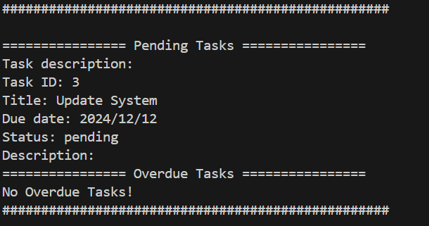
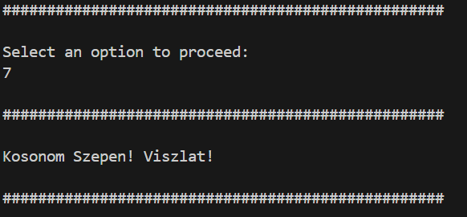

# Task Manager Application
## By: Kipchirchir Raphael - LGL7CS

## Overview
The Task Manager Application helps you organize and track tasks with options for both personal and work-related tasks. Use this tool to create, view, delete, save, and load tasks (to and from CSV file), and check for pending or overdue tasks.

## Features
- Create personal and work tasks.
- View (1. Personal Tasks, 2. Work Tasks and 3. All Tasks), delete, and save tasks to CSV.
- Load tasks from a CSV file.
- View pending and overdue tasks.

## Requirements
- Python 3.12.0 or higher

## Usage
1. Run `python interface.py` to start.
2. Follow the menu to create, view, delete, save, or load tasks. 
    - # Menu Screen
        

    - # Creating personal task
        

    - # Creating work task
        

    - # View Tasks
        

    - # Delete a task
        

    - # Save the task list to a CSV file
        

    - # Load tasks from a CSV file
        

    - # View pending and overdue tasks
        

    - # Exit
        
        
3. Use `task_list.csv` to save and load tasks.

## Structure
- `interface.py`: Used mainly for User interaction. This defines the menus where it prompts the user to select an option to perform and guides him/her accordingly
- `task_manager.py`: Task management. This file contains the TaskManager Class that helps us manage the collection of tasks
- `task.py`: Task classes. This file contains the Task Class, PersonalTask Class and WorkTask Class that helps us create new tasks, change task priority, add team members to work tasks, set description of tasks and display to the user the information about the task.

## Future Enhancements
- Future work is to implement the Graphical User Interface (GUI) to have users interact with the application with the GUI rather than the command line interaction, possibility of managing recurring tasks, and sending notifications (probably).
- Also, we can save the tasks into database as well for permanent storage.

## References
1. https://www.geeksforgeeks.org/writing-csv-files-in-python/
2. https://docs.python.org/3/library/csv.html
3. https://realpython.com/python-csv/
4. Lecture and Practice notes and codes 
