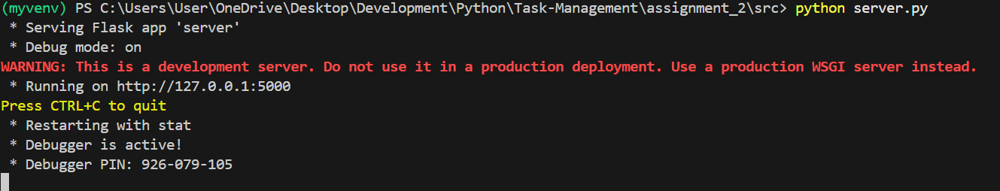
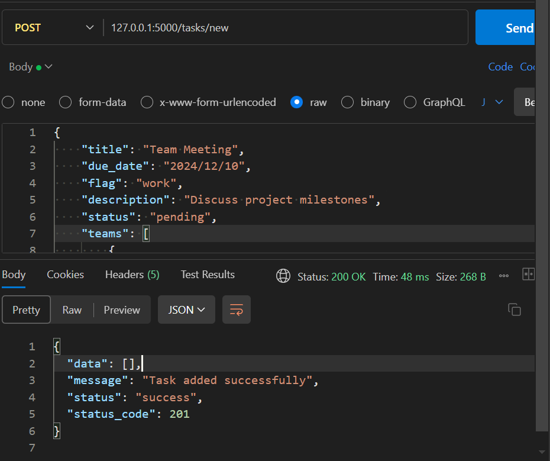
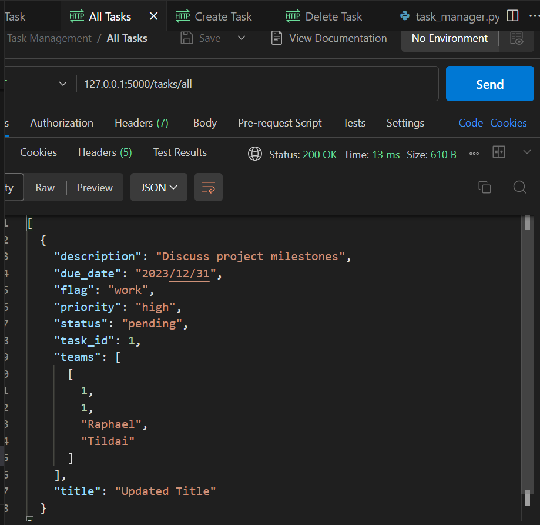
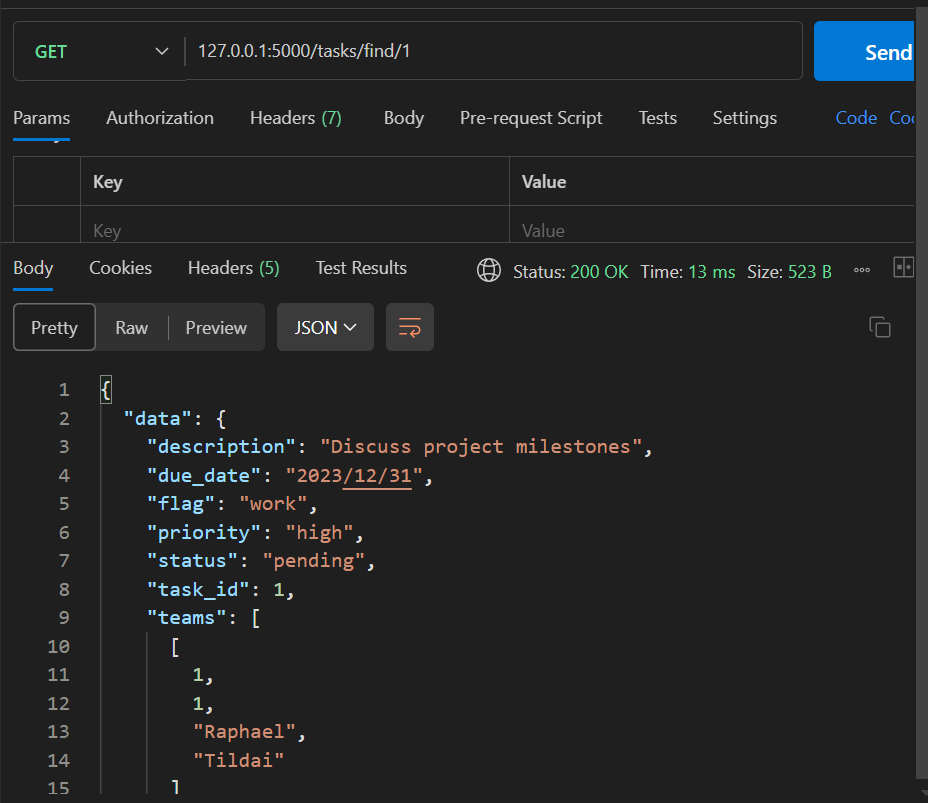
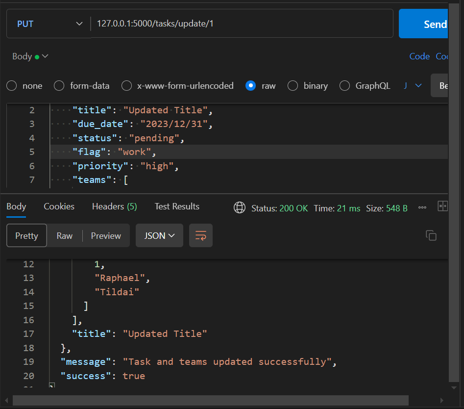
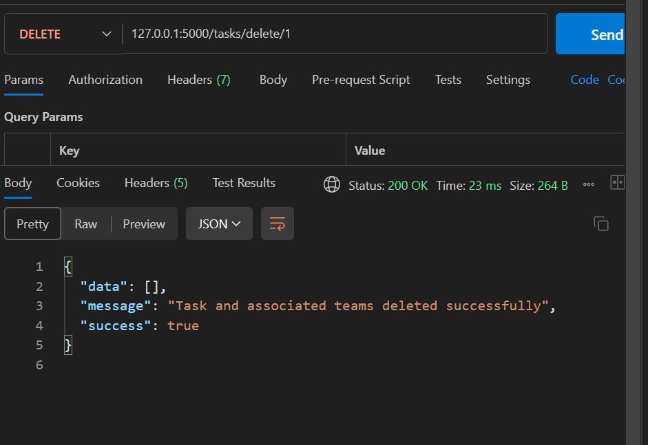
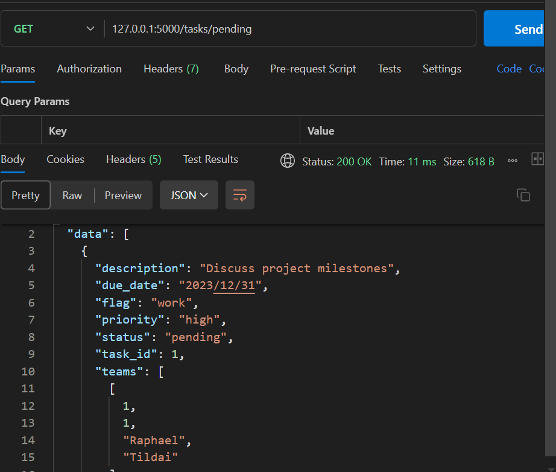
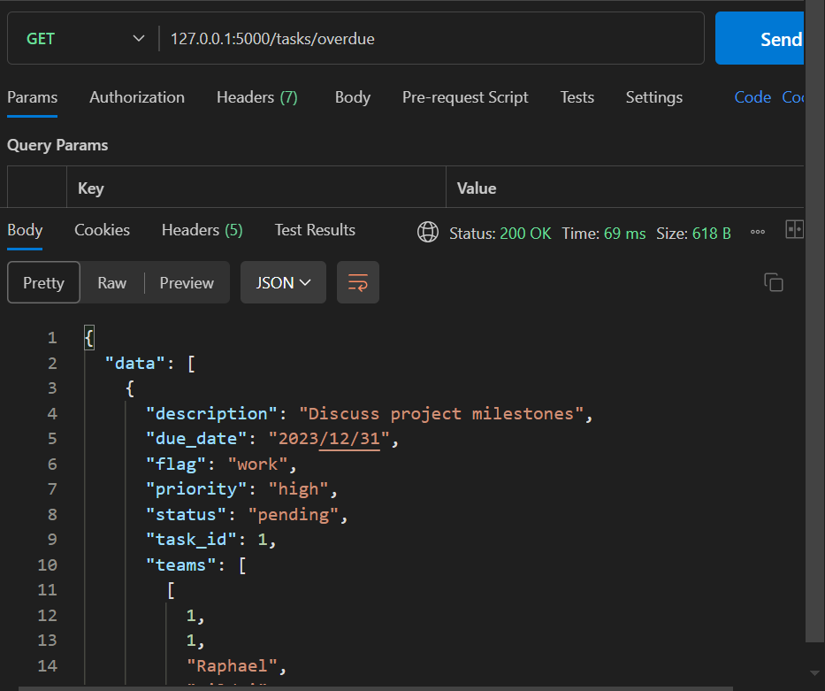

# Task Manager Application (Extension)
## By: Kipchirchir Raphael - LGL7CS

## Overview
The Task Manager Application helps users organize and track tasks efficiently. It provides an API for creating, viewing, updating, and deleting tasks, with data stored in a database for persistent and robust management.

This is an extension from the previous application which was storing data in CSV file and interaction of the user was by use of console interface.

## Key Features
- Task Creation: Create tasks with details such as title, due date, status, description, and more.
- Task Management: View, update, and delete tasks via API endpoints.
- Task Status: Retrieve pending and overdue tasks.
- Database Integration: Save tasks directly to a database instead of a CSV file for enhanced reliability.
- API Access: Fully functional RESTful API for interaction with the task manager.

## Setup Instructions
### Prerequisites
- Python 3.12.0 or higher.
- Flask framework.
- Database (SQLite).

## Steps to Run:
1. Clone or download the repository.
    ```bash
    git clone https://github.com/Raphtildai/Task-Management.git
    cd assigment_2
    ```

2. Create a virtual environment to run the application by using the following command
    ```bash
    python -m venv myvenv
    ```
3. Activate the virtual environment by running the following command
    ```bash
    myvenv scripts/activate
    ```
4. Once the virtual environment has been activated, you can install the required dependencies for this project by running the following command. In some environments, use `pip3` instead of `pip`:
    ```bash
    pip install Flask
    cd src
    pip install -r requirements.txt 
    ```
5. Once everything is set up, you can start the server by running the following command
    ```bash
    python server.py
    ```
    
6. Once the server is up and running, you can now communicate with the application by using tools such as postman or curl to perform the various tests. 
    - Access API: The API will be available at
        ```bash
        http://127.0.0.1:5000.
        ```

## API Endpoints
1. Add a New Task
- URL: http://127.0.0.1:5000/tasks/new
- Method: POST
- Request Body (JSON):
    ```bash
    {
        "title": "Team Meeting",
        "due_date": "2024/12/10",
        "flag": "work",
        "description": "Discuss project milestones",
        "status": "pending",
        "teams": [
            {
                "first_name": "Dr. Gerel",
                "last_name": "Lecturer"
            }
        ]
    }
    ```
- Response:
    ```bash
    {
    "data": [],
    "message": "Task added successfully",
    "status": "success",
    "status_code": 201
    }
    ```
    

2. Retrieve All Tasks
- URL: http://127.0.0.1:5000/tasks/all
- Method: GET
- Response:
    ```bash
    {
    "data": [
        {
        "description": "Discuss project milestones",
        "due_date": "2024/12/10",
        "flag": "work",
        "priority": "low",
        "status": "pending",
        "task_id": 1,
        "teams": [
            [
            1,
            1,
            "Dr. Gerel",
            "Lecturer"
            ]
        ],
        "title": "Team Meeting"
        }
    ],
    "message": "Tasks retrieved successfully.",
    "status": "success",
    "status_code": 200
    }
    ```
    

3. Retrieve a Task by ID
- URL: http://127.0.0.1:5000/tasks/find/<task_id>
- Method: GET
- Response:
    ```bash
    {
    "data": {
        "description": "Discuss project milestones",
        "due_date": "2024/12/10",
        "flag": "work",
        "priority": "low",
        "status": "pending",
        "task_id": 1,
        "teams": [
            [
                1,
                1,
                "Dr. Gerel",
                "Lecturer"
            ]
        ],
        "title": "Team Meeting"
    },
    "message": "Task found",
    "success": true
    }
    ```
    

4. Update a Task
- URL: http://127.0.0.1:5000/tasks/update/<task_id>
- Method: PUT
- Request Body (JSON):
    ```bash
    {
        "title": "Updated Title",
        "due_date": "2024/12/31",
        "status": "completed",
        "flag": "work",
        "priority": "high",
        "teams": [
            {
                "first_name": "Raphael",
                "last_name": "Tildai"
            }
        ]
    }
    ```

- Response:
    ```bash
    {
    "data": {
        "description": "Discuss project milestones",
        "due_date": "2023/12/31",
        "flag": "work",
        "priority": "high",
        "status": "pending",
        "task_id": 1,
        "teams": [
        [
            1,
            1,
            "Raphael",
            "Tildai"
        ]
        ],
        "title": "Updated Title"
    },
    "message": "Task and teams updated successfully",
    "success": true
    }
    ```
    

5. Delete a Task
- URL: http://127.0.0.1:5000/tasks/delete/<task_id>
- Method: DELETE
- Response:
    ```bash
    {
    "data": [],
    "message": "Task and associated teams deleted successfully",
    "success": true
    }
    ```
    

6. Retrieve Pending Tasks
- URL: http://127.0.0.1:5000/tasks/pending
- Method: GET
- Response:
    ```bash
    {
    "data": [
        {
        "description": "Discuss project milestones",
        "due_date": "2023/12/31",
        "flag": "work",
        "priority": "high",
        "status": "pending",
        "task_id": 1,
        "teams": [
            [
            1,
            1,
            "Raphael",
            "Tildai"
            ]
        ],
        "title": "Updated Title"
        }
    ],
    "message": "Pending tasks retrieved successfully.",
    "status": "success",
    "status_code": 200
    }
    ```
    

7. Retrieve Overdue Tasks
- URL: /tasks/overdue
- Method: GET
- Response:
    ```bash
    {
    "data": [
        {
        "description": "Discuss project milestones",
        "due_date": "2023/12/31",
        "flag": "work",
        "priority": "high",
        "status": "pending",
        "task_id": 1,
        "teams": [
            [
            1,
            1,
            "Raphael",
            "Tildai"
            ]
        ],
        "title": "Updated Title"
        }
    ],
    "message": "Overdue tasks retrieved successfully.",
    "status": "success",
    "status_code": 200
    }
    ```
    

## Future Enhancements
1. Graphical User Interface (GUI): Implement a GUI for users to interact with the application using a more intuitive interface.
2. Recurring Tasks: Add support for recurring tasks (e.g., daily, weekly).
3. Notifications: Implement notifications to remind users of pending or overdue tasks by:   - Integrate email or SMS reminders.

## References
1. https://www.tutorialspoint.com/sqlite/index.htm
2. https://www.geeksforgeeks.org/flask-tutorial/
3. https://python-adv-web-apps.readthedocs.io/en/latest/flask.html
4. Lecture and Practice notes and codes 

## Supervisor
- Dr. Gerel - Lecturer Eotvos Lorand University
## Subject
- Python programming